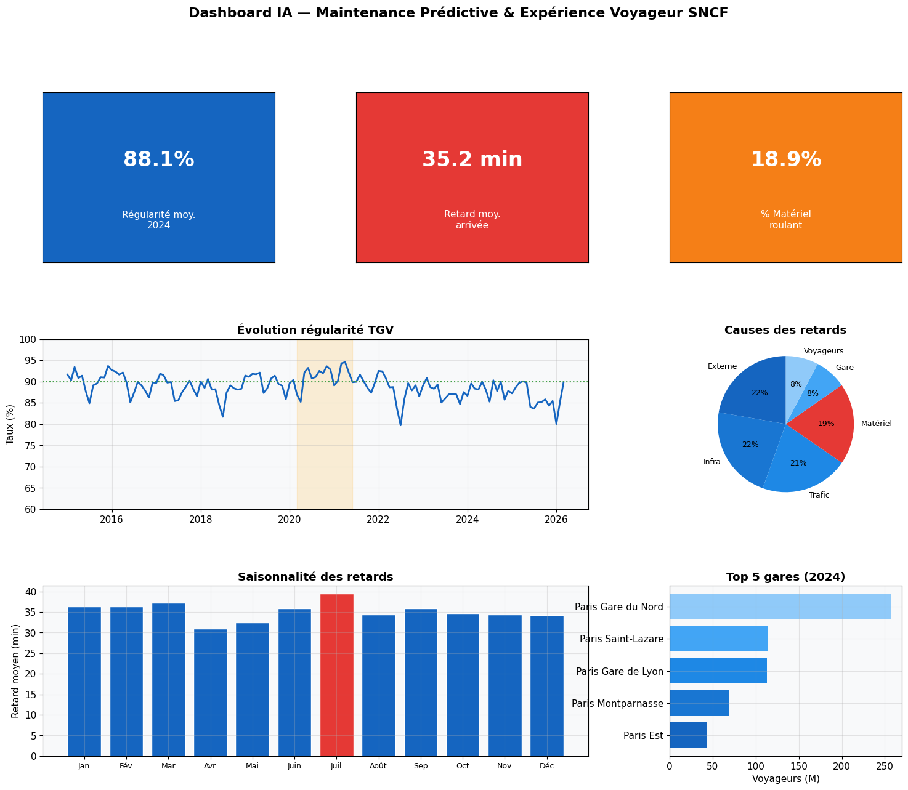
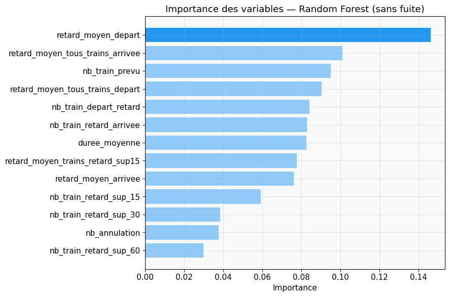
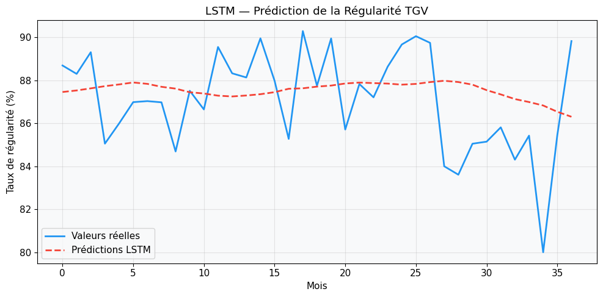
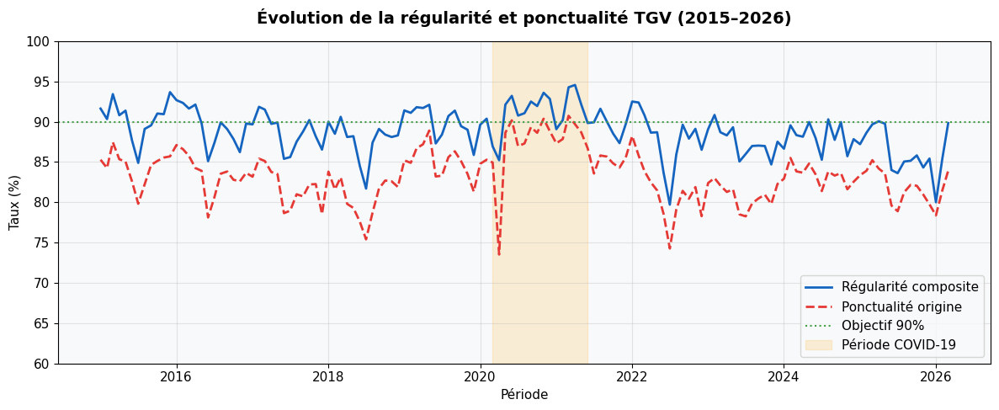
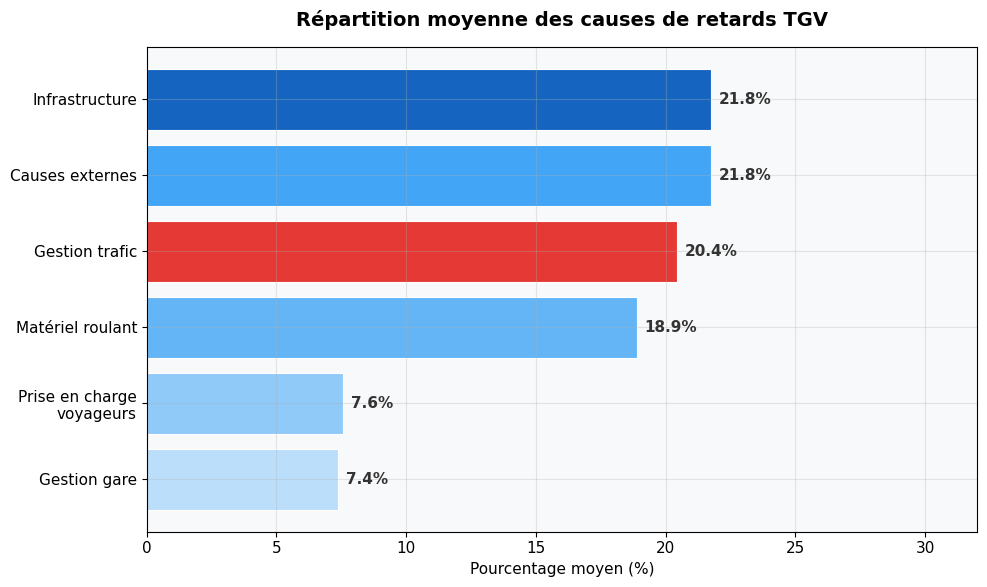

# 🚄 Maintenance prédictive et ponctualité des TGV avec l'IA

> Mémoire professionnel de Master 1 Data & IA, Nexa Digital School, mené en autonomie (octobre 2025 – juin 2026).
> Données : **open data SNCF**. Projet académique, sans lien avec la SNCF.



## La question

Comment la SNCF peut-elle exploiter ses données pour **anticiper les incidents** et **améliorer la ponctualité**, au moment où la concurrence (Trenitalia, Renfe) arrive sur ses lignes TGV ?

## Ce que montre ce projet

| | Résultat |
|---|---|
| 📦 Données | 3 jeux open data SNCF, **15 337 enregistrements**, centralisés dans une base SQLite |
| 🔍 Analyse | Le matériel roulant explique **18,9 %** des retards ; infrastructure et matériel réunis, **plus de 40 %** |
| 🌲 Random Forest | **AUC 0,70**, F1-score 0,64, stable en validation croisée (± 0,005) |
| 🧠 LSTM | Prévision de la régularité mensuelle avec une **erreur moyenne de 1,9 point** (objectif : moins de 3) |

### Le point clé : une fuite de données détectée et corrigée

Une première version du Random Forest affichait une **AUC de 0,916**. Le score était trop beau : les six causes de retard sont des pourcentages d'un même total, donc connaître cinq d'entre elles permet de déduire la sixième, qui était justement la cible. Le modèle « trichait ».

Ces variables ont été retirées. Le modèle honnête atteint une AUC de **0,70**. Cet écart avec la cible de production (0,90) est le résultat central du mémoire : **l'open data agrégée ne suffit pas pour une maintenance réellement prédictive**. Il faut les données internes des capteurs embarqués (télédiagnostic, kilométrage des rames, historique des réparations).

## Démarche

1. **Collecte** : téléchargement automatique des 3 jeux de données via l'API open data SNCF, puis centralisation dans une base SQLite (`sncf_maintenance.db`).
2. **Nettoyage** : traitement des valeurs manquantes, suppression des colonnes vides, conversion des dates, période figée au 31 mars 2026 pour garantir la reproductibilité.
3. **Exploration** : régularité depuis 2015, causes des retards, saisonnalité, gares les plus fréquentées, corrélations.
4. **Modélisation** :
   - **Random Forest** (scikit-learn) : classer chaque mois-liaison selon le risque lié au matériel roulant. 100 arbres, profondeur 10, classes équilibrées, découpage 70/30.
   - **LSTM** (TensorFlow/Keras) : prédire la régularité du mois suivant à partir des 12 mois précédents. 2 couches (50 et 25 neurones), Dropout 20 %, arrêt anticipé.
5. **Restitution** : tableau de bord de synthèse et recommandations.

## Résultats en images

| Importance des variables (Random Forest) | Prédiction de la régularité (LSTM) |
|---|---|
|  |  |

| Évolution de la régularité 2015-2026 | Répartition des causes de retards |
|---|---|
|  |  |

D'autres graphiques sont disponibles dans le dossier [`images/`](images/) : matrice de confusion, courbe d'apprentissage, saisonnalité, distribution des retards, corrélations, gares les plus fréquentées.

## Structure du dépôt

```
├── notebooks/
│   └── analyse_exploitation_sncf.ipynb   # tout le code, de la collecte au dashboard
├── docs/
│   ├── memoire_maintenance_predictive_sncf.pdf   # mémoire complet (42 pages)
│   └── soutenance_memoire_sncf.pptx              # support de soutenance
├── data/
│   └── README.md                         # sources et licence des données
├── images/                               # graphiques exportés du notebook
└── requirements.txt
```

## Lancer le projet

Le plus simple : ouvrir le notebook dans **Google Colab** et exécuter les cellules dans l'ordre. Les données sont téléchargées automatiquement.

En local :

```bash
pip install -r requirements.txt
jupyter notebook notebooks/analyse_exploitation_sncf.ipynb
```

## Stack

Python · pandas · NumPy · SQLite · scikit-learn · TensorFlow/Keras · Matplotlib · Seaborn · Google Colab

## Pistes d'amélioration

- Enrichir le modèle avec des données internes (capteurs, météo, signalisation) pour viser un F1-score de 0,85.
- Optimiser le Random Forest avec une recherche d'hyperparamètres (GridSearchCV).
- Mettre en place un suivi des modèles en production (MLOps) pour détecter les dérives.

---

👩‍💻 **Nosaiba Elkrekshi** · Master 2 Data & IA · [LinkedIn](https://www.linkedin.com/in/nosaiba-elkrekshi) · nosaiba.elkrekshi@gmail.com
